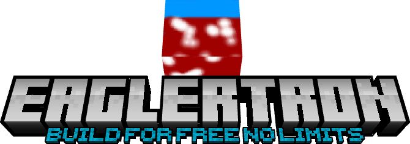

#  EaglerTron v1.5.00
 

Eaglertron is a free and open-source desktop launcher for Eaglercraft.

It is designed for gamers who cannot afford Minecraft or who want a lightweight alternative experience. Built with Electron, Eaglertron aims to provide a simple way to play Eaglercraft on desktop devices.

## Features

* Free to use
* Open-source
* Desktop application
* Lightweight interface
* Based on Eaglercraft

## About Eaglercraft

Eaglercraft is an open-source project. Please respect its original license and contributors.

## Contributing

Contributions are welcome! Feel free to fork the project, improve it, and create your own versions.

## Disclaimer

Eaglertron is an independent community project and is not affiliated with Mojang Studios or Microsoft.

 

 ## Versions
 __v1.5.00__ - Added customizable launcher options, credits, settings, more memory options, and updated code! 
 __v1.4.00__ - Added patch notes, bug fixes, and integrated mods! 
 __v1.3.10__ - Organized and updated code, added memory options, more games, installations, usernames, and faq screen! 
 __v1.2.00__ - Updated games. 
 __v1.1.00__ - Updated code and optimized! 
 __v1.0.00__ - Main code with future updates planned!

 

## Installation
 Currently just download the repository for the source code! 
 Future plans for an offline file may be possible!

## Features Planned

Click here to expand feature list

- [ ] Add the servers screen
- [x] Add Credits screen
- [x] Add Settings screen
- [x] Rewrite some of the css and js
- [x] Organize code, and add comments
- [x] Add a customizable launcher selector
- [x] Save last played game 
- [x] Add FAQ screen
- [x] Add Installations screen
- [x] Add Mods screen
- [ ] Add Skins screen
- [x] Add Patch Notes screen
- [ ] Fix display errors
- [ ] Offline launcher download?

credits to Ivr77 *

subscribe on my youtube channel for more info

>__Finally [here]() is the live version of the code!__88888888888888888888888888888
